# AI Face Recognition Attendance System

> **Client showcase website:** The new React/Vite frontend is ready for client
> presentations and Vercel deployment. Run `npm install` then `npm run dev`.
> See [WEBSITE.md](WEBSITE.md) for website setup, customization and deployment.
> It uses fictional demo data and is independent of the Python application below.

**FaceTrack** is a complete local-camera attendance application for a university deep learning demonstration. It detects a face, aligns it, generates a pretrained deep learning embedding, matches a registered identity, and requires a temporal head-turn challenge before recording sign-in or sign-out.

The application includes administrator authentication, multi-sample enrollment, atomic SQLite attendance, dashboard analytics, filtered CSV export, biometric removal, and automated tests. It runs on CPU and does not train a neural network from scratch.

**Deployment scope:** a single trusted computer with a locally attached webcam. This is a working demonstration foundation, not a certified biometric access-control product. Before real deployment, evaluate accuracy on your population, replace basic liveness with validated presentation-attack detection, and implement your organization's consent, retention, device security and access policies.

## Quick start — Windows / Python 3.11

Open PowerShell in this project directory. Install Python 3.11 if it is not available.

```powershell
py -3.11 -m venv venv
.\venv\Scripts\Activate.ps1
python -m pip install --upgrade pip
pip install -r requirements.txt
python scripts/download_models.py
python scripts/setup_admin.py
streamlit run app.py
```

If `python` already refers to Python 3.11, the equivalent environment command is:

```powershell
python -m venv venv
```

For Windows Command Prompt, activation is `venv\Scripts\activate.bat`. If PowerShell blocks activation, use `venv\Scripts\python.exe -m pip install -r requirements.txt` and `venv\Scripts\python.exe -m streamlit run app.py` directly. Do not change machine execution policy just to activate a virtual environment.

For Linux/macOS, create with `python3.11 -m venv venv` and activate with `source venv/bin/activate`; subsequent commands are the same.

The administrator setup script creates `.env` from `.env.example` and prompts for a password of at least 12 characters. It stores only a salted scrypt hash. Do not paste a real password into source files or chat. The app starts at **http://127.0.0.1:8501**. SQLite initializes automatically at `data/attendance.db` on startup; no separate database server is required.

### This workspace's prepared environment

If the project-local `.venv` supplied during development is present:

```powershell
.\.venv\Scripts\python.exe scripts/setup_admin.py
.\.venv\Scripts\python.exe -m streamlit run app.py
```

Model downloads are about 37 MiB combined. `scripts/download_models.py` downloads the official YuNet 2023mar and SFace 2021dec ONNX artifacts, verifies their published SHA-256 identifiers, and skips valid existing files. Models load lazily; dashboard and administration remain available without them. Model binaries and biometric data are ignored by Git.

## Features and workflow

1. **Administrator access:** open Registration, Dashboard or Administration and log in. The kiosk is available without admin privileges. Login is throttled to five failed attempts per five-minute window across sessions in the local process. Sessions expire after 30 minutes by default.
2. **Registration:** enter a unique 2–32 character employee/student ID and a name. Obtain consent, start the camera, then click Capture sample five separate times with small pose variations. No-face, multiple-face, small, blurry, badly lit, clipped and inconsistent-face samples are rejected. Save registration after collecting all samples. The app stores one normalized mean embedding; raw images are never written to disk. Existing IDs are rejected case-insensitively. A similar existing face is flagged for administrator review.
3. **Sign in:** choose Sign In on the kiosk and start the camera. Look straight ahead, turn toward the requested preview edge, then return to center. The same identity must match on every accepted frame. Successful verification records attendance once per local calendar day.
4. **Sign out:** choose Sign Out and repeat the challenge. A sign-in must already exist for that day; repeat sign-outs cannot overwrite the original timestamp. Wait for the cooldown if you just signed in.
5. **Analytics:** the admin dashboard shows active registrations, today's attendance, today's still-open records, all-time sign-ins, sign-outs and unknown events. Filter by date, name, ID or person; charts and CSV reflect the filtered records. Daily, weekly (Monday-ending buckets), monthly and hourly sign-in charts are provided.
6. **Removal:** in Administration, choose a person and type their ID. This deletes their biometric template and archives the identity. Historical attendance, audit entries and the reserved ID remain. Removal is not full erasure of historical personal information.
7. **Stop the camera:** use Stop camera, navigate away, or log out. A background lease reaper releases the camera after a disconnected session stops reading for eight seconds. Only one browser session owns the physical camera at a time.

The preview is not mirrored. The challenge refers to the left/right **edge of the displayed image**, not your anatomical left/right. Camera frames come from the machine running Python, not a remote browser. Keep the default localhost binding; remote webcam capture would require a separate authenticated WebRTC implementation.

## Architecture and project structure

```text
app.py                         Streamlit entry point and navigation
requirements.txt               Pinned Python 3.11 application/test dependencies
requirements-lock.txt          Exact resolved versions from validation
VALIDATION.md                  Completed checks and hardware-testing limits
.env.example                   Configuration template
.streamlit/config.toml         Local binding, theme and security defaults
config/settings.py             Typed, validated settings
database/database.py           Parameterized queries and atomic transactions
database/schema.sql            Executable SQLite schema
face/detector.py                YuNet face and landmark detection
face/preprocessing.py           Quality checks and head pose proxy
face/embeddings.py              Embedding normalization
face/recognizer.py              SFace backend, protocol and cosine matching
face/liveness.py                Randomized challenge state machine
services/registration.py        Identity validation and multi-sample enrollment
services/verification.py        Recognition → liveness → attendance orchestration
ui/auth.py                     Admin session checks and login
ui/live.py                     Live kiosk and enrollment fragments
ui/dashboard.py                Metrics, filters, CSV and charts
ui/admin.py                    User list and biometric deletion
utils/camera.py                 Exclusive camera lease and rendering
utils/security.py               Password hashing, throttling and CSV protection
scripts/download_models.py      Model download with hash verification
scripts/setup_admin.py          Interactive administrator setup
scripts/check_models.py         Real detector, alignment and embedding smoke check
models/README.md                Model source/license references
tests/                         Database, security, pipeline, UI and liveness tests
data/attendance.db             Created at runtime (ignored by Git)
```



```mermaid
flowchart LR
    Camera --> YuNet[Face detection + landmarks]
    YuNet --> Quality[Exactly one face + quality checks]
    Quality --> Align[Landmark alignment]
    Align --> SFace[128-dimensional SFace embedding]
    SFace --> Match[Cosine threshold + ambiguity margin]
    Match --> Challenge[Consecutive identity + head-turn challenge]
    Challenge --> Validation[Cooldown + daily attendance validation]
    Validation --> SQLite
    SQLite --> Confirmation[UI confirmation]
```

### Deep learning methodology

YuNet predicts a face bounding box and five landmarks. Quality checks run before SFace's `alignCrop`, which uses landmarks to align the face. SFace's pretrained network produces a 128-dimensional feature vector, normalized to unit length. Enrollment averages several consistent normalized embeddings and normalizes the result. Recognition uses the dot product between normalized query and stored vectors (cosine similarity).

A query must exceed the configurable threshold and beat the second-best identity by the configured margin. Otherwise it is labeled **Unknown Face**, and attendance is never recorded. Similarity is a matching score, not a probability or confidence percentage.

SFace and YuNet were chosen because OpenCV exposes both directly, supports CPU inference and landmark-based alignment, and avoids heavyweight training and dlib compilation. The selected ONNX versions work with the pinned OpenCV 4.11 build. See the official [YuNet model documentation](https://github.com/opencv/opencv_zoo/tree/main/models/face_detection_yunet) and [SFace model documentation](https://github.com/opencv/opencv_zoo/tree/main/models/face_recognition_sface). Review upstream model licenses before redistribution.

`FaceBackend` separates extraction from orchestration. To replace the model, implement `model_version` and `extract(frame)`, update the embedding dimension validation/storage if needed, supply compatible head-pose landmarks, and re-enroll users. Never compare embeddings produced by different model versions. The gallery filters by model version.

### Basic liveness and consecutive verification

The challenge first collects five consistently recognized, centered frames. It then randomly asks for one preview direction, requires three consecutive frames with enough normalized nose displacement, and requires three centered frames on return. Every frame must still match the same identity. Unknown faces, quality failures, multiple faces, identity changes, excessive frame gaps, action changes and challenge timeouts reset progress. A constant photograph cannot pass the motion sequence by remaining still.

This geometric heuristic is **not proof of liveness**. Moving/warping a photograph, replaying a suitable video, virtual cameras or deepfakes can defeat it. Multiple frames alone are also not anti-spoofing. Do not use this implementation as the sole basis for payroll, high-stakes attendance penalties or physical access. A validated anti-spoof model, depth/IR hardware and an alternative attendance process are appropriate upgrades.

## Configuration

Edit `.env` and restart Streamlit. Environment variables take precedence. Paths are relative to the project root unless absolute.

| Setting | Default | Meaning |
| --- | --- | --- |
| `DATABASE_PATH` | `data/attendance.db` | SQLite file |
| `TIMEZONE` | `Asia/Karachi` | Local date and timezone-aware timestamps |
| `CAMERA_INDEX` | `0` | Local OpenCV camera index |
| `RECOGNITION_THRESHOLD` | `0.50` | Minimum cosine similarity |
| `RECOGNITION_MARGIN` | `0.06` | Separation from second-best person |
| `DETECTION_THRESHOLD` | `0.90` | YuNet detection threshold |
| `MIN_FACE_SIZE` | `90` | Minimum bounding-box width and height in pixels |
| `MIN_BLUR_SCORE` | `65` | Minimum grayscale Laplacian variance |
| `VERIFICATION_FRAMES` | `5` | Initial consecutive centered identity frames |
| `ATTENDANCE_COOLDOWN` | `30` | Seconds per identity after a completed attempt |
| `LIVENESS_TURN_DELTA` | `0.16` | Nose displacement change / eye distance |
| `LIVENESS_HOLD_FRAMES` | `3` | Consecutive turn and return frames |
| `LIVENESS_TIMEOUT` | `20` | Challenge expiration in seconds |
| `MAX_FRAME_GAP` | `1.5` | Maximum gap between processed challenge frames |
| `REGISTRATION_SAMPLES` | `5` | Enrollment captures |
| `ADMIN_SESSION_MINUTES` | `30` | Fixed admin session lifetime |
| `ADMIN_PASSWORD_HASH` | empty | Set through interactive setup script |

Higher recognition thresholds reduce false matches but increase false rejections. Calibrate with held-out genuine and impostor pairs from consenting users and report false acceptance/rejection rates. The default is a starting point, not a validated deployment operating point. Head-pose and quality thresholds likewise depend on the camera and lighting.

## Database schema and privacy

The complete runnable schema is in [`database/schema.sql`](database/schema.sql).

| Table | Stored information |
| --- | --- |
| `users` | Internal key, unique employee ID, name, creation timestamp, active flag |
| `biometrics` | User foreign key, model version, float32 embedding bytes, dimension |
| `attendance` | User key, snapshot of ID/name, date, sign-in, optional sign-out, verified status |
| `unknown_attempts` | Timestamp and date only; no image or inferred identity |
| `audit_log` | Enrollment/removal timestamp, action, employee ID |
| `schema_version` | Schema version for future migrations |

`UNIQUE(user_id,date)` prevents duplicate attendance even under concurrent requests. Sign-in/sign-out validation runs inside `BEGIN IMMEDIATE` transactions. Foreign keys are enabled on every connection; WAL and busy timeouts reduce lock contention. The service gates `Database.mark` behind matching and liveness; this local Python method is not a public API or security boundary against someone who can modify the program/database.

Embeddings are sensitive biometric data. They are stored separately from attendance and never included in UI tables, CSV exports or application logs. This is logical separation in the same database, **not encryption**. Protect `.env`, the database, SQLite WAL files and backups with OS permissions and disk encryption. Do not commit or share `data/`. Raw camera frames and captured samples remain in process/session memory. Biometric deletion may leave traces in database free pages, journals and backups; organizational deletion procedures must cover those as well.

CSV output neutralizes spreadsheet formula prefixes in user-supplied strings. Admin routes all check authentication server-side. The default server binds only to localhost. Anyone controlling the OS account can change application code or the database; this implementation assumes a trusted kiosk host.

## Testing

```powershell
python -m pytest -q
python -m compileall -q app.py config database face services ui utils scripts
```

Tests cover duplicate/invalid attendance, concurrent sign-ins, clock regression, next-day behavior, archival and template removal, model isolation, literal search, matching ambiguity, liveness continuity, mixed enrollment samples, input validation, hashing, login throttling, CSV formula protection and the full verification gate using deterministic test embeddings. They do not establish real-world model accuracy.

After downloading the models:

```powershell
python scripts/check_models.py
python -m streamlit run app.py --server.headless true
```

The model check runs the actual YuNet detector and SFace feature network. A no-face test is expected to reject a blank image. The application startup check uses Streamlit's test runner and local HTTP health endpoint during development.

### Manual camera acceptance checklist

- Register a consenting person with five captures; reject no-face/multiple-face captures and a duplicate ID.
- Confirm a registered person completes the random turn-and-return challenge and gets exactly one sign-in.
- Confirm a stationary printed photograph, unknown face, face swap or interrupted sequence cannot mark attendance.
- Try sign-out before sign-in, repeat sign-in and repeat sign-out; verify each expected message.
- Test real faces under varied lighting/pose and measure false acceptance/rejection before choosing thresholds.
- Check dashboard totals, date/person filters, each chart, CSV, admin expiry and logout.
- Disconnect the camera and close a browser tab; verify errors and eventual camera release.

## Troubleshooting

| Symptom | Action |
| --- | --- |
| Python launcher reports a missing executable | Install/reinstall Python 3.11 or use a working 3.11 interpreter explicitly. |
| Models missing or OpenCV load failure | Run the model downloader; do not download Git LFS pointer text as ONNX. Use the pinned requirements. |
| Download blocked | Allow HTTPS to official GitHub model hosting and retry. Hash mismatches are rejected. |
| Camera unavailable / permission denied | Enable desktop camera access in Windows Privacy settings, close other camera apps, try index 1, and restart. |
| Camera in use by another session | Stop that session or wait for the eight-second inactive lease to expire. |
| Face rejected as blurry or too small | Improve lighting, avoid backlight, move closer, hold still and clean the lens. |
| Challenge repeatedly restarts | Keep only one face in view and reduce frame processing load; tune `MAX_FRAME_GAP` for your CPU after measurement. |
| Registered person appears unknown | Check lighting/pose and model version, then re-enroll. Calibrate thresholds rather than lowering them blindly. |
| Database is locked | Use a local disk, avoid external long-running write transactions and close other tools editing SQLite. |
| Forgot admin password | Run `python scripts/setup_admin.py` on the trusted host and restart. |
| Overnight sign-out is rejected | Attendance is deliberately per calendar day; cross-midnight shifts are not implemented. |

## Known limitations and future improvements

- Basic liveness is vulnerable to deliberate replay and presentation attacks. Replace it with independently evaluated anti-spoofing and suitable hardware.
- Webcam hardware, live challenge completion, demographic performance and operating thresholds require local acceptance testing; automated tests cannot certify them.
- One attendance interval per calendar day; no multiple shifts, breaks or cross-midnight shift matching.
- Cooldowns and unknown-event throttles are in process/session memory; daily duplicate prevention remains durable in SQLite. Unknown events are not a count of distinct people.
- One physical camera and a trusted local host. Multi-device deployments need device authentication, centralized storage, durable rate limiting and audited administration.
- Admin uses one local account. Future work: individual accounts, RBAC/SSO, tamper-evident attendance auditing and persistent lockout controls.
- Enrollment duplicate-face detection is heuristic. Twins/lookalikes may need manual review and an alternative attendance method.
- No encrypted database, automated retention scheduling, backup UI, certified demographic evaluation, trained anti-spoof model or attendance correction workflow.
- Large galleries use a linear cosine scan. Add indexed vector search and benchmark throughput if scaling beyond a small institutional demo.

See [`VALIDATION.md`](VALIDATION.md) for the checks actually completed in this workspace and their limits.
